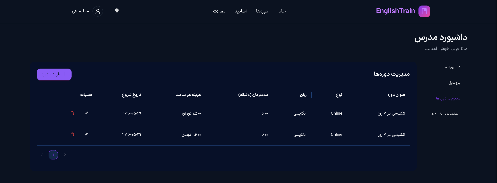

# Educational Platform

A modern educational platform built with Next.js 16 and TypeScript, designed for teachers, students, and administrators. This app includes tutor approval flow, course publishing, student enrollment, and payment receipt verification to provide a complete learning marketplace experience.

## Key Features

- ✅ Teacher and student authentication with separate dashboard experiences
- ✅ Tutor registration requires admin approval before publishing courses
- ✅ Course publication workflow for approved teachers
- ✅ Student enrollment with payment receipt upload for verification
- ✅ RTL support for Persian interfaces
- ✅ Light and dark theme switching using Redux Toolkit and Ant Design
- ✅ Centralized API handling with Axios and secure server-state management via React Query
- ✅ Responsive course browsing, tutor profiles, and dashboard management

## Technologies Used

- **Framework:** Next.js 16
- **Language:** TypeScript
- **UI Library:** Ant Design (`antd`) with `@ant-design/nextjs-registry`
- **Styling:** Tailwind CSS with Ant Design component styling
- **State Management:** Redux Toolkit for client state, including theme control
- **Data Fetching:** TanStack Query (`@tanstack/react-query`) for remote data and caching
- **HTTP Client:** Axios for API requests and token handling
- **Forms & Validation:** React Hook Form with Yup / Zod support

## Running Locally

1. Install dependencies:

```bash
npm install
```

2. Start development server:

```bash
npm run dev
```

3. Open the app:

[http://localhost:3000](http://localhost:3000)

## Project Screenshots

<p align="center">
  
  
  
</p>

## Important Notes

- Theme state is managed in Redux and applied through Ant Design `ConfigProvider`
- Server state is handled with a shared React Query `QueryClient`
- API calls use a centralized Axios instance in `src/lib/axios.ts`
- Admin workflow is required for tutor approval before tutors can publish their courses
- Students must upload payment receipts when registering for a course to enable verification

## Sample Test Credentials

- **Teacher**
  - Email: `manamobahi73@gmail.com`
  - Password: `123`
- **Student**
  - Email: `mm@gmail.com`
  - Password: `123`

## Developer Notes

- Root providers are configured in `src/lib/providers.tsx` for Redux, React Query, Ant Design, and theming
- Theme state lives in `src/features/theme/themeSlice.ts`
- API logic is organized under `src/features/*/api` with Axios and React Query hooks
